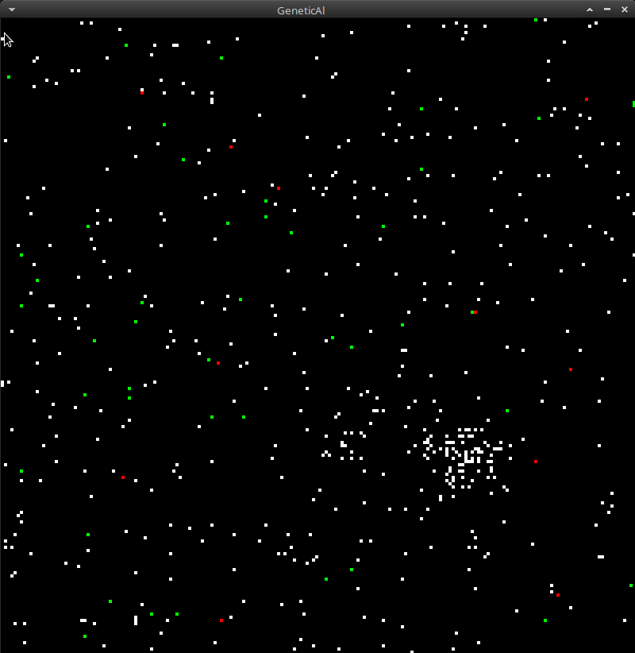

<p align="center">
  <br>
  
  <br>
</p>

# GeneticAl
Симуляция генетического алгоритма

Для отрисовки используется [Ebitengine](https://github.com/hajimehoshi/ebiten).

#### Установка зависимостей
```
# For Debian/Ubuntu
$ sudo apt install libc6-dev libglu1-mesa-dev libgl1-mesa-dev libxcursor-dev libxi-dev libxinerama-dev libxrandr-dev libxxf86vm-dev libasound2-dev pkg-config
```

#### Запуск
```
go run cmd/main.go
```